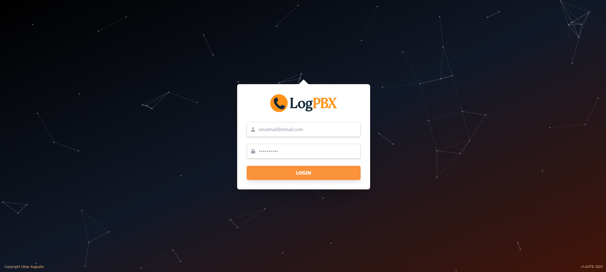

## **Angular Login Frontend – Autenticação de Acesso**

Este projeto consiste em um frontend desenvolvido em Angular, para a criação de telas de login, gerenciamento de sessão e integração com APIs de autenticação de backend.

⚠️ **Atenção:** Este projeto foi concebido com propósitos estritamente educacionais e de demonstração. Embora funcional, não é otimizado para ambientes de produção e deve ser utilizado apenas para estudo e compreensão das tecnologias envolvidas. O foco principal é a implementação da autenticação e a arquitetura do frontend.  

🎯 **Objetivo do Projeto**

Este projeto foi criado com o intuito de explorar e demonstrar a integração de diversas tecnologias e conceitos, servindo como um estudo de caso prático para:

- **Implementação de Formulário de Login**: Demonstra a construção de um formulário de login reativo e validado, com foco na experiência do usuário e na segurança dos dados de entrada.
- **Integração com API de Autenticação**: Ilustra como um frontend Angular pode se comunicar com um backend(API REST) para enviar credenciais, receber tokens de autenticação (como JWT) e gerenciar o estado da sessão do usuário.
- **Gerenciamento de Estado de Autenticação**: Explora o uso de serviços Angular para armazenar e gerenciar o token de autenticação, o status de login do usuário e outras informações de sessão.
- **Proteção de Rotas (Route Guards)**: Apresenta a implementação de Guards no Angular para proteger rotas, garantindo que apenas usuários autenticados possam acessar determinadas partes da aplicação.
- **Tratamento de Erros de Autenticação**: Demonstra como lidar com diferentes cenários de erro durante o processo de login (credenciais inválidas, problemas de conexão, etc.) e fornecer feedback adequado ao usuário.

📸 **Visualização do Projeto**  

*Tela de Login:*

Uma interface limpa e intuitiva para que os usuários possam inserir suas credenciais e acessar o sistema.

